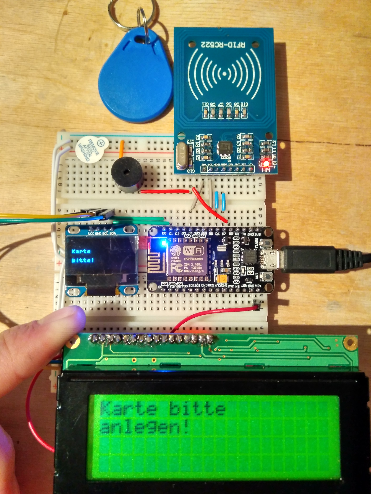

# micropython-RFID-oled-LCD
Micropython project to test the MFRC522 RFID reader and two types of display-drivers

## RFID
The module ``mfrc522.py`` is for accessing the cheap RFID module via SPI-Bus. The chpis are technicaly able to talk I2C but the board doesn't provide this funtionality be default. You have to unsolder or drill into the board to enable it. So i continued with SPI. This micropython-class to access RFID readers came from here: [https://github.com/wendlers/micropython-mfrc522](https://github.com/wendlers/micropython-mfrc522).

## Display
The files ``esp8266_i2c_lcd.py`` and ``lcd_api`` are borrowed from [python_lcd](https://github.com/dhylands/python_lcd) and provide access to the HD77480-compatible LC-Display with an PCF8574 Backpack. On some Backpacks, an alternate chip (MCP23008) is used, but not in this project. Please make shure, you set DISPLAY_I2C_ADDR to the corresponding address of your module. I have a PCF8574A with a default address of 0x3F.

The PCF8574 has addresses 0x20 .. 0x27
The PCF8574A has addresses 0x38 .. 0x3F

The module ``ssd1306.py`` is for accessing the cheap oled-Displays. It works perfectly out of the box.

You are asking, why I use two Displays? For testing and ... because I can!

## Usage
Put the modules ``mfrc522.py``, ``esp8266_i2c_lcd.py``, ``lcd_api``, ``ssd1306.py`` and ``buzzer.py`` to the root of the flash FS on your board. 
For the ESP8266 there are multiple solutions to do that. E.g. use the
* [adafruit-ampy](https://github.com/adafruit/ampy) , 
* [mpy-utils](https://github.com/nickzoic/mpy-utils), 
* [WebREPL file transfer](https://github.com/micropython/webrepl), or 
* [mpfshell](https://github.com/wendlers/mpfshell). 

I recommend using [mpfshell](https://github.com/wendlers/mpfshell) or the oldschool [adafruit-ampy](https://github.com/adafruit/ampy). They both work good but mpfshell is much more fun and easier to use. With [mpy-utils](https://github.com/nickzoic/mpy-utils) your can mount your esp8266 to your filesystem (WOW!) but you have to unmount if you need to enter the REPL (o_O). Thus its a much slower routine. I cannot recommend it.

### wifi
The two files in the wifi folder are for quick ifup or ifdown of the wifi. Simple enter REPL and import them.

    import wifi.wifi_up
or

    import wifi.wifi_down
Do not forger to enter your SSID and Password beforehand.

## Wiring
I used the following pins for my setup:

| Signal    | GPIO ESP8266 | GPIO NodeMCU   | Note                                 |
| --------- | ------------ | -------------- | ------------------------------------ |
| sck       | 14           | "D5"           |                                      |
| mosi      | 12           | "D6"           |                                      |
| miso      | 13           | "D7"           |                                      |
| rst       | 4            | "D2"           |You don't need the rst Pin. Try it!   |
| cs        | 2            | "D4"           |Labeled SDA on most RFID-RC522 boards |
|                                                                                  |
| scl       | 5            | "D1"           | This is for the I2C-Bus              |
| sda       | 16           | "D0"           | This is for the I2C-Bus              |
| buzzer    | 15           | "D8"           | A tiny buzzer without wave-generator |

